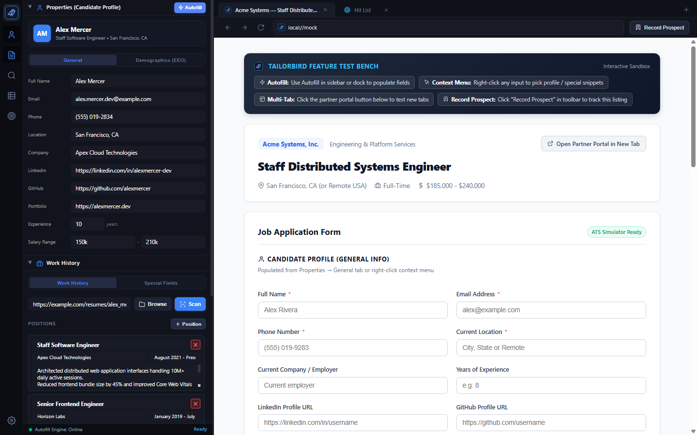
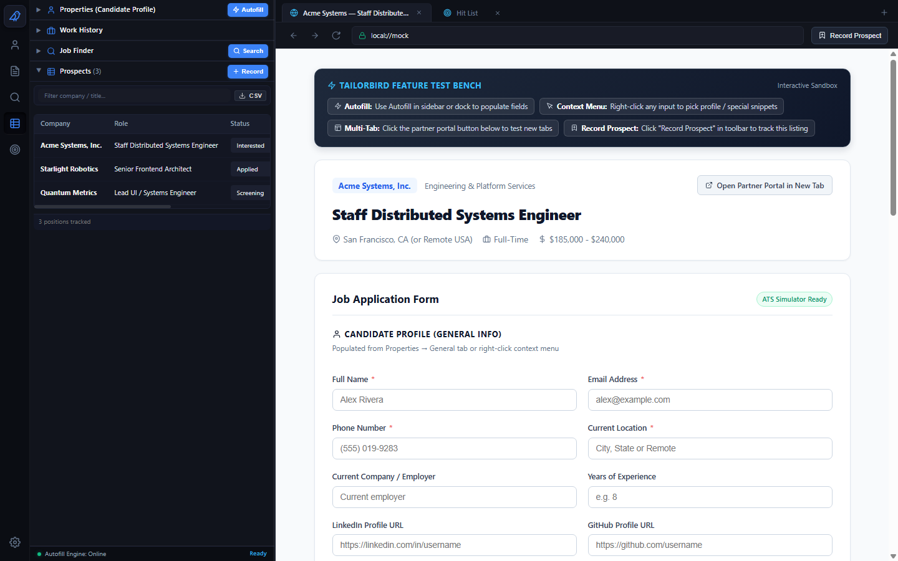
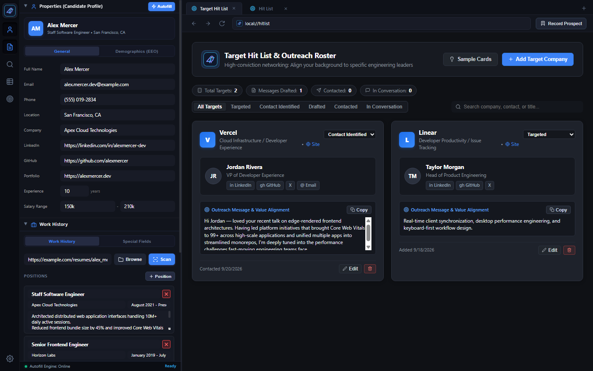
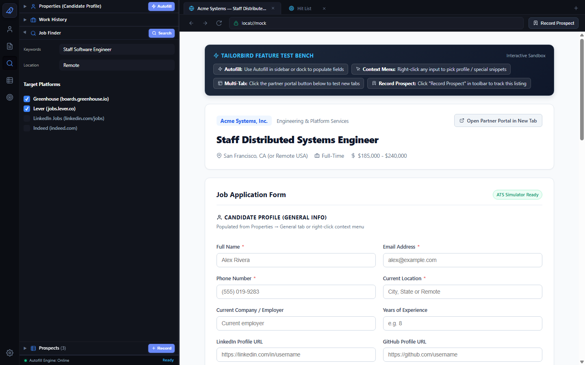
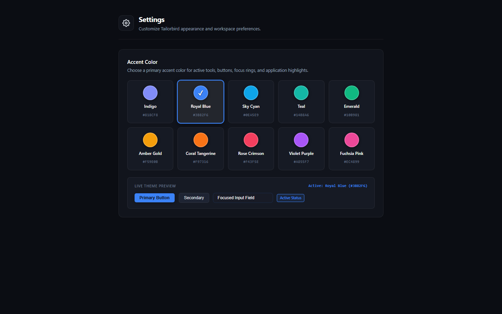

<div align="center">
  
  <h1>Tailorbird</h1>
  <p><strong>Specialized Desktop Browser for Job Hunting</strong></p>
</div>

Tailorbird pairs a personal information panel with a full web browser in a split-screen view, keeping your resume details, past positions, tracked listings, and outreach notes right next to the application forms you are filling out.



---

## Features

### Side-by-Side Workspace
The left panel keeps your candidate information accessible while you browse job listings on the right. The divider between panels can be resized to whatever width fits your display.

### Candidate Profile & Work History
- Store your core application details (contact information, portfolio links, standard demographic responses).
- Import past work history from a resume file or manage positions manually.
- Save reusable answers to open-ended application questions (e.g. background summaries, cover notes).
- Right-click any input in the browser pane to insert specific profile fields or saved snippets directly into the form.

### Application Form Filling
- Fill common form fields across job boards with a single click.
- Highlights remaining unfilled fields so required questions are easily spotted before submitting.

### Prospects Tracking
Track positions as you find them without keeping dozens of tabs open or switching to a separate spreadsheet.
- Save the current job listing directly from the toolbar.
- Record company name, role, application status, date added, and personal notes.
- Filter records and export your prospect list to a CSV file at any time.



### Outreach Roster
For proactive networking and direct outreach, the Outreach Roster tracks companies and key contacts.
- Track target companies, contacts, and communication status.
- Draft custom outreach messages and value alignment notes.
- Copy draft messages to your clipboard with one click.



### Job Finder
Build targeted search queries for platforms like Greenhouse, Lever, LinkedIn, and Indeed based on job title, location, and remote preferences.



### Local Data Storage
All candidate profiles, application tracking, and notes are saved locally on your computer in a JSON file (`tailorbird_data.json`). Your information stays on your device.

### Appearance
Choose from multiple accent colors to personalize your workspace.



---

## Building and Running

### Prerequisites
- Build tools / toolchain

### Instructions

```bash
# Clone the repository
git clone https://github.com/joelstransky/Tailorbird.git
cd Tailorbird

# Run the app
cargo run

# Or compile a release binary
cargo build --release
```

The compiled binary will be located in `target/release/tailorbird` (or `tailorbird.exe` on Windows).

---

## License

MIT License. See `LICENSE` for details.
